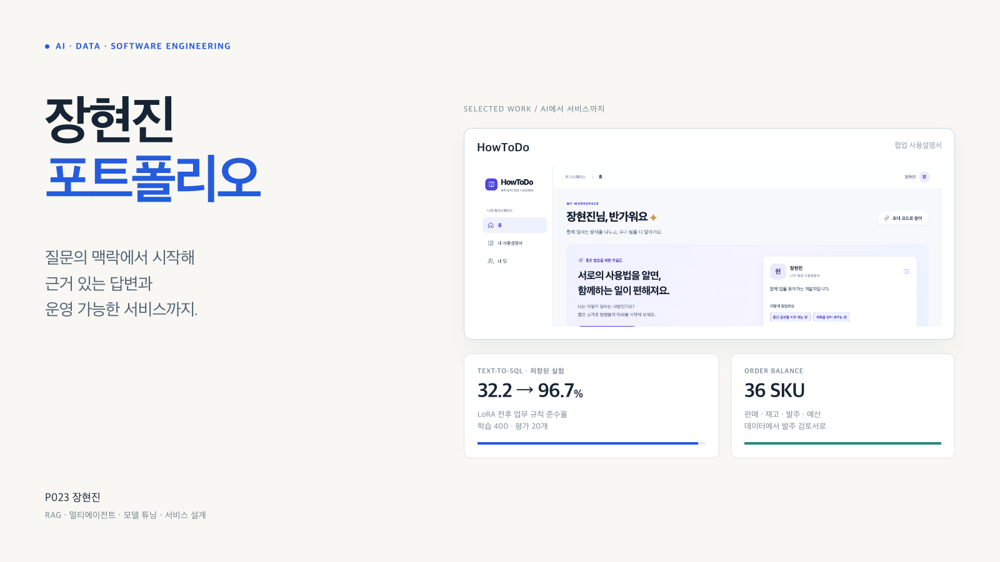
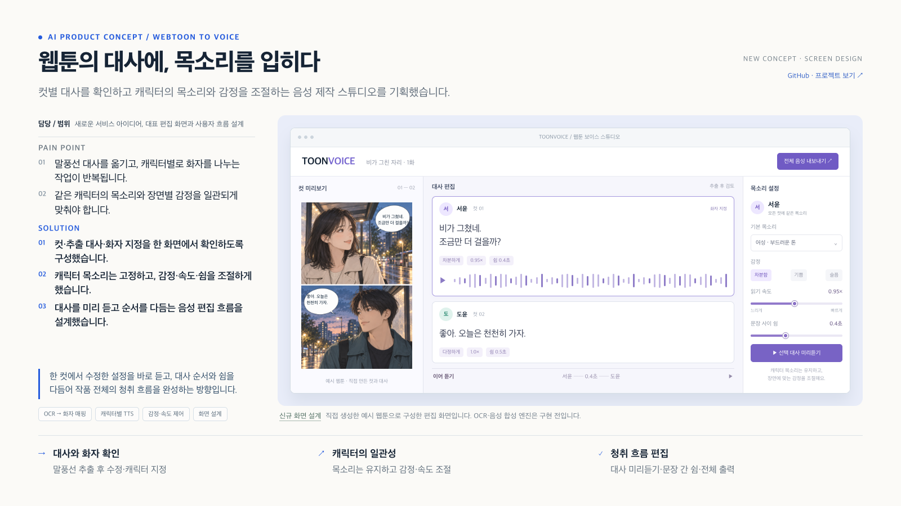

# 장현진 | AI & Software Portfolio

정확도·출력 일관성·응답 속도·비용을 함께 고려하며 AI 기능을 서비스에 연결한 프로젝트와 학습 결과를 정리했습니다.

[GitHub 프로필](https://github.com/KR-Nom) · [포트폴리오 HTML](./portfolio/index.html) · [편집·PDF 저장 안내](./portfolio/README.md)

## AI · 모델

| 프로젝트 | 내용 | 공개 범위 |
|---|---|---|
| [Order Balance](./LLM/order-balance/) | 재고·판매·예산 기반 발주 검토, 호출·토큰 비용 분석 | 노트북·입력 데이터·결과 CSV |
| [Developer Prompt ER](./Langchain/) | 질문 진단, 구조화 출력, 질문 전후 답변 비교 | LangChain·Gradio 구현 |
| [PDF RAG](./LLM/rag/) | PDF 추출·청크·임베딩·FAISS 검색·답변 생성 | 실습 코드·실행 안내 |
| [Text-to-SQL · LoRA](./sLLM/) | 업무 규칙에 맞춘 소형 모델 학습·평가 | 학습 코드·데이터·GPU 가이드 |
| [CNN 학습 비교](https://github.com/KR-Nom/skala-python-deep-learning) | Fashion-MNIST에서 8개 학습 전략과 과적합 비교 | 별도 공개 저장소 |
| [QuizFlash](./Answer/) | macOS 캡처·스트리밍 API·최신 요청 제어·지연 계측 | Swift 코드·테스트 |

## 제품 · 화면

| 프로젝트 | 내용 | 공개 범위 |
|---|---|---|
| [ToonVoice](./projects/toonvoice/) | 웹툰 대사·화자·목소리·감정 편집 | 새로 만든 정적 UI 프로토타입 |
| [HowToDo](./WebService/) | 협업 프로필·팀 보드·역할·공유 | Vue·MSW Mock API·OpenAPI·DBML |
| [SKALA Shop](./Spring/Online-shoppingmall/) | 주문·취소·재고·포인트의 트랜잭션 | Spring Boot·JPA·H2·통합 테스트 |
| [CourtCast](./WebService/Court/) | 현장 제보·주변 코트 비교·즐겨찾기 | 원본 앱 화면 갤러리·설계 설명 |
| [Weather Flow](./Vue/skala-vue/src/components/practices/HandsOn/) | 날씨 검색·즐겨찾기·단위·API 상태 관리 | Vue·Router·Pinia·Axios |
| [HONBOT · 자율주행](./projects/ai-experience/) | API 연결과 CNN 데이터 보완 경험 | 경험 설명과 새로 구성한 대표 UI |

## 데이터 · 운영

| 프로젝트 | 내용 | 공개 범위 |
|---|---|---|
| [GOLABA](./MSA/) | 신청 접수와 긴 AI 검수를 분리하는 REST·Kafka 설계 | 담당 범위와 설계 판단 |
| [3-tier 게시판](./workspace/Day2/) | Nginx·Flask·PostgreSQL·healthcheck·volume | Compose 구성·서비스 코드 |
| [매출 EDA](https://github.com/KR-Nom/skala-python-day2) | 100만 행 정제·분포·통계·Ridge Pipeline | 별도 공개 저장소 |
| [PostgreSQL 튜닝](./DB/종합실습3/) | 실행계획·인덱스·반복 측정 비교 | SQL·실행계획 캡처·측정 조건 |
| [AIOps 화면 설계](./projects/aiops/) | 요청·토큰·지연·오류 분석의 연결 | 향후 확장을 위한 정적 UI |

## ToonVoice 대표 화면

컷과 대사를 나란히 확인하고 캐릭터별 목소리와 감정·속도·쉼을 설정하는 화면입니다. OCR·음성 합성 엔진은 아직 연결하지 않았습니다.

## 포트폴리오 사용

`portfolio/index.html`을 내려받아 브라우저에서 열면 이미지가 포함된 22장 가로 포트폴리오가 표시됩니다. 문장을 직접 수정하고 **편집본 저장**으로 보관할 수 있습니다. **PDF로 저장**을 누르고 배경 그래픽을 켜면 제출용 PDF로 저장할 수 있습니다.

원본 실행 결과와 새로 만든 화면 설계를 구분했으며, 측정값에는 데이터·실험 조건을 함께 적었습니다. 각 프로젝트의 자세한 실행 방법은 해당 README에 있습니다.

API 키와 비밀 설정, 가상환경·빌드 파일, 교육 원본 PDF·개인 자료는 포함하지 않았습니다.
