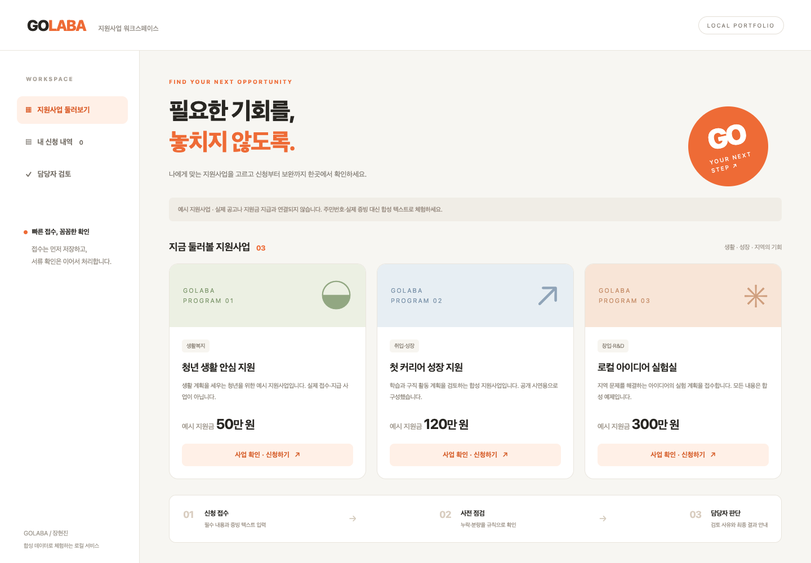

# GOLABA · 지원사업 접수와 검토

신청을 먼저 저장하고 서류 점검을 후속 작업으로 처리하는 **HTML·JavaScript + FastAPI + SQLite** 로컬 실행본입니다. 지원사업 선택 → 신청 접수 → 규칙 기반 사전 점검 → 보완 제출 → 담당자 승인까지 한 화면에서 체험합니다.



2026-09-28에 기존 GOLABA 설계를 바탕으로 AI 개발 도구와 함께 새로 구현했습니다. 과거 팀 프로젝트 원본이나 운영 실적을 복원한 결과가 아닙니다. 원본 `MSA/msa-lecture1`의 Vue·Spring·Kafka 교육 코드와 인증 이미지는 변경하지 않았습니다.

## 실행

Python 3.11 이상을 사용합니다.

```bash
cd projects/golaba
python3 -m venv .venv
.venv/bin/python -m pip install -r requirements.txt
# 담당자 기능이 필요할 때만, 본인이 정한 16자 이상 문자열을 입력합니다.
export GOLABA_REVIEWER_TOKEN='replace-with-your-own-local-token'
.venv/bin/python -m uvicorn app:app --host 127.0.0.1 --port 8317
```

브라우저에서 <http://127.0.0.1:8317>을 엽니다. API 문서는 `/docs`입니다. 담당자 화면의 토큰 입력란에 서버에 설정한 같은 문자열을 입력하면 1시간의 담당자 권한이 부여됩니다. 환경변수가 없거나 16자보다 짧으면 담당자 기능은 사용할 수 없고 신청·사전 점검은 작동합니다. 토큰은 프론트 소스·localStorage·API 응답에 저장하지 않습니다.

## 체험 순서

1. **지원사업 둘러보기 → 사업 확인 · 신청하기**를 누릅니다.
2. **예시 내용 채우기**로 합성 신청서와 증빙을 입력합니다. 증빙 하나를 지우고 접수하면 누락을 확인할 수 있습니다.
3. 접수 즉시 `CHECKING`을 응답합니다. SQLite worker가 저장된 작업을 가져가 필수 증빙의 존재·20자 이상 여부를 확인합니다.
4. 부족한 내용은 **보완 필요**, 모두 입력됐으면 **담당자 검토 대기**로 표시됩니다. 신청 목록은 2초마다 점검 상태를 갱신합니다.
5. 보완 요청은 **보완 제출**로 수정합니다. 같은 신청의 제출 차수를 올리고 새 점검 작업을 생성합니다.
6. **담당자 검토**에서 토큰으로 인증하고 증빙·점검 내역을 확인한 뒤 승인 또는 보완 사유를 저장합니다. 사전 점검을 통과하지 못한 신청은 승인할 수 없습니다.
7. 새로고침하거나 서버를 재시작해도 같은 브라우저의 신청·처리 이력이 유지됩니다. 다른 브라우저에는 해당 신청이 보이지 않습니다.

**사전 점검은 AI가 아닙니다.** 규칙은 증빙 텍스트의 존재와 분량만 확인하며 서류 진위·자격·지급 적합성을 판단하지 않습니다. 담당자 판단이 최종 단계입니다. 지원사업·지원금액·예시 신청서 전부 합성 데이터이며 실제 공고·공공기관·지급 시스템과 연결되지 않습니다.

## 상태와 저장 구조

```text
접수 ─→ CHECKING ─→ READY ─→ 담당자 APPROVED
                └→ NEEDS_SUPPLEMENT ← 담당자 보완 요청
                      └→ 재제출 / revision + 1 ─→ CHECKING
점검 3회 실패 ─→ CHECK_FAILED ─→ 재제출
```

- `sessions`: 난수 쿠키의 SHA-256 해시, 소유권 만료 7일, 담당자 권한 만료 1시간. 브라우저에는 HttpOnly·SameSite=Lax 쿠키를 사용합니다.
- `applications`: 브라우저 소유권, 신청 내용, 현재 제출 차수와 상태, 점검 결과, 담당자 사유.
- `jobs`: 신청·차수별 UNIQUE 작업, QUEUED/RUNNING/DONE/FAILED, claim과 30초 임대, 재시도 횟수.
- `events`: 접수·사전 점검·보완 제출·담당자 판단 이력.

신청 저장과 작업 생성은 하나의 SQLite 트랜잭션입니다. 작업 획득에는 `BEGIN IMMEDIATE`를 사용하고 완료 시 claim·제출 차수·현재 상태를 다시 확인합니다. 중복 실행으로 결과나 이력을 두 번 반영하지 않습니다. 프로세스가 종료되면 만료된 작업 임대를 새 worker가 회수합니다. 작업은 백그라운드에서 처리되므로 단순 규칙 점검이 빠르게 끝나면 화면에서 대기 상태가 짧게 보일 수 있습니다.

기본 DB는 `runtime/golaba.sqlite3`, 변경은 `GOLABA_DB=/로컬/경로.sqlite3`입니다. 실행 데이터·환경파일·가상환경은 `.gitignore`에서 제외합니다.

## API

| API | 기능 |
|---|---|
| `GET /api/health`, `GET /api/session` | 상태·로컬 세션 생성/조회 |
| `GET /api/projects` | 합성 지원사업·필수 증빙 목록 |
| `POST /api/applications` | 접수·작업 생성, 202 응답 |
| `GET /api/applications`, `GET /api/applications/{id}` | 본인 신청·상세·이력 |
| `PUT /api/applications/{id}` | 보완 내용 재제출 |
| `POST /api/reviewer/session` | 서버 토큰 검증·담당자 권한 부여 |
| `DELETE /api/reviewer/session` | 담당자 권한 해제 |
| `GET /api/reviewer/applications` | 담당자용 최신 신청 200건 |
| `POST /api/reviewer/applications/{id}/decision` | 차수·상태 확인 후 승인/보완 판단 |

## 검증

```bash
.venv/bin/python -m unittest discover -s tests -v
node --check static/app.js
```

실제 임시 SQLite와 FastAPI TestClient를 사용하는 8개 통합 테스트를 실행했습니다. 모의 API 응답이나 가짜 worker를 사용하지 않습니다.

- 누락 사전 점검 → 보완 → 재점검 → 승인, 승인 후 수정 금지
- 다른 브라우저의 목록·상세·수정 차단, 담당자 API 권한 검사
- 중복 접수 차단, 두 worker 동시 실행 시 작업·이력 한 번만 반영
- 만료된 작업 임대의 새 앱 인스턴스 회수와 DB 지속성
- 담당자 로그인·로그아웃, 오래된 차수 판단 차단
- 잘못된 입력·임의 소유권·다른 출처 쓰기 요청 거부
- 토큰 미설정 시 담당자 권한 거부
- 실제 백그라운드 worker의 자동 처리

현재 환경의 Starlette가 TestClient `httpx` 경로에 deprecation warning을 출력하지만 테스트는 통과했습니다. 새로운 HTTP 클라이언트를 전역 설치하거나 기존 환경을 변경하지 않았습니다.

2026-09-28 실제 브라우저에서도 다음 흐름을 확인했습니다. 로컬 8317 Uvicorn 서버와 별도 `golaba-qa` 브라우저 세션을 사용했으며 검증 후 브라우저 세션은 닫았습니다.

- 예시 신청서에서 생활 계획서만 비우고 접수 → worker가 **보완 필요**로 변경, 상세에 해당 증빙의 누락 사유 표시
- 보완 폼에서 생활 계획 입력 → 2차 제출 → **담당자 검토 대기**
- 담당자 토큰 로그인 → 증빙 확인 → 승인 사유 입력 → **승인 완료**
- 페이지 새로고침 후 승인·2차 제출·담당자 사유 유지. SQLite 직접 조회도 `APPROVED`, `revision=2`, 작업 2건 `DONE`, 처리 이력 5건과 일치
- 1440px·390px에서 문서 가로 넘침 없음. 390px의 신청 dialog도 너비 352px, 내부 가로 넘침 없음
- 브라우저 예외·콘솔 오류 없음

검증 기록: [JSON](docs/browser-verification.json). 캡처: [데스크톱](docs/screen.png), [누락 사유](docs/supplement-request.png), [승인 결과](docs/approved.png), [모바일](docs/mobile.png), [모바일 신청 폼](docs/mobile-form.png).

## 범위

로컬 단일 컴퓨터용 포트폴리오 데모입니다. 인터넷 공개를 위한 사용자 계정·계정 복구·운영 담당자 식별·분산 작업 큐·파일 진위 확인·감사 보관 정책은 포함하지 않습니다. 브라우저 쿠키를 지우거나 7일이 지나면 예전 신청에 다시 접근할 수 없습니다. 증빙은 텍스트만 받으며 PDF/OCR 업로드를 지원하지 않습니다.

원본 MSA 설계의 Kafka·서비스별 DB·AI 서류 분석을 구현한 것처럼 표시하지 않습니다. 이번 실행본은 SQLite durable queue와 규칙 점검으로 접수와 후속 검토의 경계를 실제 검증한 범위입니다. 웹 UI는 기존 GOLABA의 오렌지 브랜드 방향을 참고해 새로 작성했으며 외부 사진·포스터는 복제하지 않았습니다.
