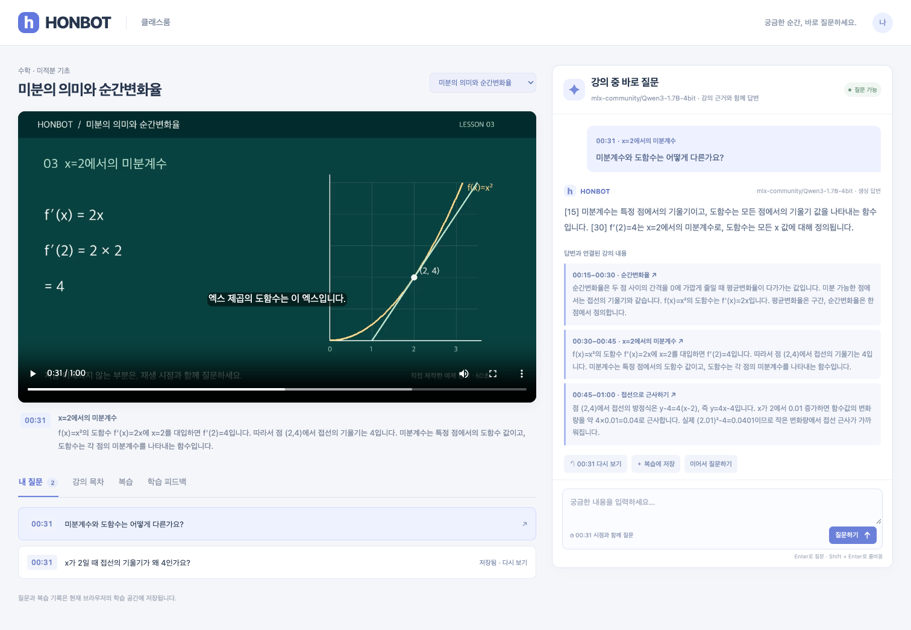

# HONBOT · 강의 중 바로 질문

강의를 보다가 이해되지 않는 부분을 **현재 재생 시점과 함께 질문**하는 학습 웹앱입니다. 영상·구간별 강의 자료·AI 답변·복습 기록을 한 화면에 연결했습니다. 2026-09-28에 기존 HONBOT 구상을 바탕으로 AI 개발 도구와 함께 새로 구현한 코드입니다.



[모바일 실행 화면](docs/screen-mobile.png) · [검증 기록](VERIFICATION.md)

## 구현 범위

- 실제 재생되는 60초 미적분 강의, 한국어 내레이션·자막·목차
- 질문 시점과 키워드로 관련 강의 구간을 선택하고 답변 근거로 표시
- OpenAI 호환 API를 통한 실제 모델 호출, 이전 질문을 잇는 후속 질문
- 근거 구간 클릭으로 영상 이동, 북마크·이해도·의견 저장
- 질문·복습 목록, 구간별 이해도 집계, 강사에게 전달할 JSON 내보내기
- SQLite 영속 저장, 브라우저별 질문 격리, 동일 요청 중복 방지와 실패 후 재시도
- 데스크톱·모바일 화면, 실패 안내와 입력 상태 복구

강의 영상은 자체 제작한 도표와 macOS 한국어 음성으로 구성했습니다. 외부 교수의 영상이나 사진을 복제하지 않았습니다. `content/lectures.json`은 직접 작성한 구간별 강의 자료이고, `media/calculus.vtt`는 실제 내레이션 자막입니다.

## 바로 실행

Python 3.11 이상을 권장합니다. 기존 가상환경이 있으면 먼저 사용합니다.

```bash
cd projects/honbot
python3 -m venv .venv
source .venv/bin/activate
python -m pip install -r requirements.txt
python -m uvicorn app:app --host 127.0.0.1 --port 8330
```

<http://127.0.0.1:8330>을 엽니다. API 문서는 `/docs`입니다. 처음에는 **강의 자료 검색 모드**로 동작합니다. 이 모드는 관련 문단을 그대로 찾아 보여 주며 화면과 응답에 AI 생성 답변이 아님을 표시합니다.

## 실제 AI 답변 연결

서버에서 환경변수를 설정하고 다시 시작합니다. `.env.example`은 설정 예시이며 앱이 `.env`를 자동으로 읽지는 않습니다. 키는 브라우저에 전달하지 않습니다.

```bash
export HONBOT_AI_MODE=openai_compatible
export HONBOT_AI_BASE_URL=http://127.0.0.1:8320/v1
export HONBOT_AI_MODEL=mlx-community/Qwen3-1.7B-4bit
# 인증이 필요한 공급자를 사용할 때만 설정:
# export HONBOT_AI_API_KEY='발급받은-키'
python -m uvicorn app:app --host 127.0.0.1 --port 8330
```

로컬 Qwen 모델 API가 이미 실행 중이면 바로 연결됩니다. 모델 다운로드와 서버 실행은 같은 저장소의 [Local AI Runtime 실행 안내](../local-ai-runtime/README.md)를 따릅니다. 앱과 모델 서버는 서로 다른 터미널에서 실행합니다.

이 로컬 런타임은 Apple Silicon·MLX 환경을 사용합니다. 다른 환경에서는 본인이 운영하는 OpenAI 호환 API를 지정하면 됩니다. 호환 API의 `/chat/completions`, `messages`, `max_completion_tokens`, `stream=false`를 사용합니다. 모델별 지원 여부는 공급자 문서를 확인하세요.

AI 서버 오류·시간 초과는 502·504로 반환합니다. 이때 강의 문단을 AI 답변으로 바꾸어 저장하지 않습니다. 같은 질문의 재시도는 동일 요청 ID를 사용하고, 이미 완료된 요청이면 저장된 응답을 반환합니다. 미완료 요청은 앱 재시작 시 실패 상태로 복구합니다.

## 체험 순서

1. 강의를 재생하거나 목차의 **미분계수** 구간으로 이동합니다.
2. `x=2일 때 기울기가 왜 4인가요?`라고 질문합니다.
3. 답변의 출처 시점을 눌러 해당 강의로 돌아갑니다.
4. 질문을 저장하고 **아직 어려워요** 피드백과 의견을 남깁니다.
5. 복습·학습 피드백 탭을 확인하고 새로고침해 기록이 남는지 봅니다.
6. 학습 피드백에서 JSON 파일을 내려받습니다. 내보내기만 수행하며 강사에게 자동 전송하지 않습니다.

## 저장 및 구조

```text
static/                 영상·질문·복습 화면
app.py                  FastAPI, 문맥 선택, 모델 호출, SQLite 저장
content/lectures.json    직접 작성한 강의와 구간 자료
media/                  재생 가능한 영상·자막·포스터
scripts/build_lesson.py  강의 미디어 재생성(macOS)
tests/test_app.py       API·DB·권한·재시도 테스트
data/honbot.sqlite3     실행 시 생성, Git 제외
```

기본 DB 경로는 `data/honbot.sqlite3`이며 `HONBOT_DB`로 변경합니다. 질문의 시점·내용·답변·근거·모델·소요 시간·북마크·피드백을 저장합니다. 난수 세션 쿠키는 HttpOnly·SameSite=Strict로 설정합니다. 쿠키를 지우거나 다른 브라우저를 사용하면 기존 기록에 접근할 수 없습니다.

로컬 단일 worker용 프로토타입입니다. 외부 공개용 로그인·다중 사용자 관리·서버 간 작업 조정은 포함하지 않았습니다. 강의 자료를 근거로 답변하지만 모델의 정답률을 보장하거나 영상 자체를 인식하는 기능은 아닙니다. 음성 인식, 자동 강의 전사, 강사 계정으로 자동 보고하는 기능은 포함하지 않았습니다.

## 검증과 미디어 재생성

```bash
python -m unittest discover -s tests -v
node --check static/app.js

# 포함된 mp4를 다시 만들 때만(macOS):
python -m pip install pillow imageio-ffmpeg
python scripts/build_lesson.py
```

질문 저장, 브라우저 간 접근 차단, 중복 요청, 실패 재시도, 재시작 후 유지, 빈 입력·시간 범위, 근거 구간 경계, AI 오류 응답, 미디어 Range 요청을 테스트합니다. 미디어 생성기는 빈 음성과 15초를 넘는 내레이션을 검사합니다. 영상은 저장소에 포함되어 있어 앱 실행만 할 때는 생성 도구가 필요하지 않습니다.

검증 결과와 한계는 `VERIFICATION.md`에 기록합니다.
