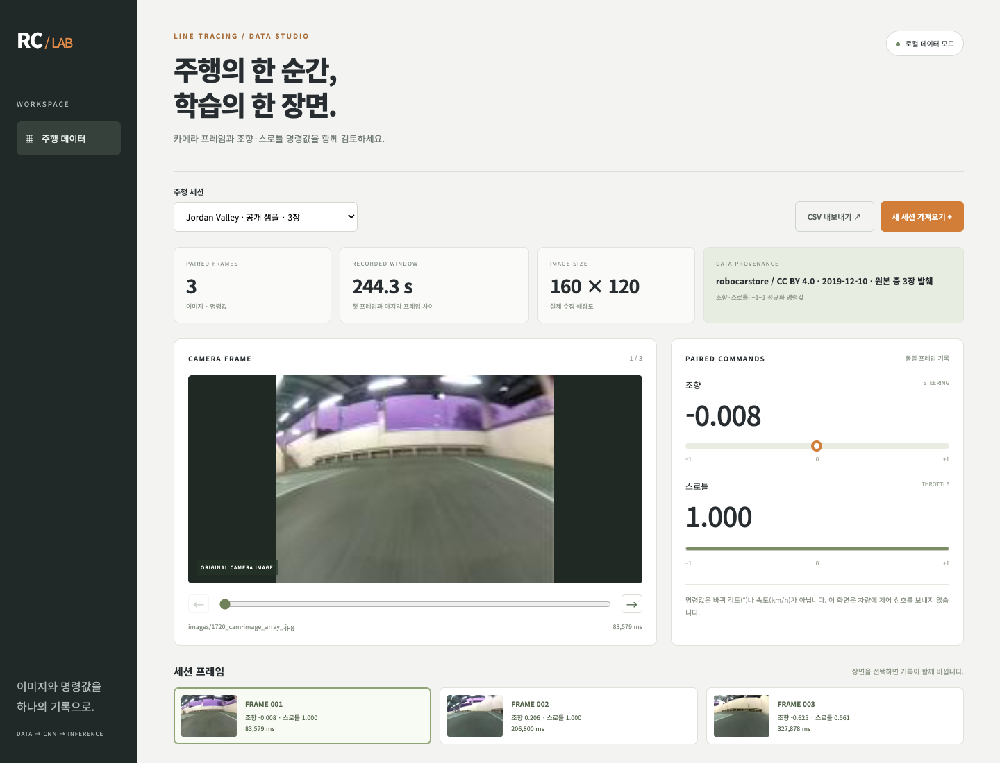

# RC 주행 데이터 스튜디오

RC카 전방 이미지와 같은 시각의 조향·스로틀 명령값을 저장하고 검토하는 로컬 웹앱입니다. 포트폴리오에서 설명한 수동 주행 → 이미지와 조작값 수집 → CNN 학습 흐름을 실행 가능한 코드로 새로 구성했습니다.



## 실행

Python 3.11 환경을 권장합니다. 이미 사용 중인 가상환경이 있으면 먼저 활성화하세요.

```bash
cd projects/line-tracing-car
python3.11 -m venv .venv
source .venv/bin/activate
python -m pip install -r requirements.txt
python -m uvicorn app:app --host 127.0.0.1 --port 8022
```

http://127.0.0.1:8022 에서 확인합니다. 첫 실행에 공개 샘플 3장을 SQLite에 넣습니다. 기본 저장 위치는 `data/`; 변경하려면 `RC_DATA_DIR`을 지정합니다. 이 앱은 로컬 검토용이며 인증 기능 없이 외부에 노출하지 않습니다.

## 구현한 기능

- 실제 160×120 카메라 프레임과 해당 원본 명령값 표시
- 세션 선택, 프레임 슬라이더/이전/다음/썸네일 탐색
- ZIP으로 CSV와 이미지 일괄 수집, 원본 이미지 보존, SQLite 영속 저장
- 파일 경로, 중복 파일/시각, 손상 이미지, NaN, 명령값 범위, 압축 크기 검증
- CSV 내보내기와 입력 형식 예제 ZIP 다운로드
- 주행 세션을 기준으로 분리하는 TensorFlow CNN 학습 및 오프라인 추론 CLI

## 직접 수집한 데이터 가져오기

ZIP 최상위에 `frames.csv`, 그 아래에 이미지 파일을 넣습니다.

```text
session.zip
├── frames.csv
└── images/
    ├── frame001.jpg
    └── frame002.jpg
```

```csv
filename,timestamp_ms,steering,throttle
images/frame001.jpg,1000,-0.12,0.40
images/frame002.jpg,2000,0.05,0.35
```

- `timestamp_ms`: 같은 주행 세션 내 0 이상의 타임스탬프. 고정 수집 주기를 가정하지 않습니다.
- `steering`, `throttle`: -1~1의 정규화된 조작 명령. 실제 각도(°)·속도(km/h)·라이다 거리와 다릅니다.
- 같은 시각의 카메라 이미지와 조작값을 수집 장치 쪽에서 묶어야 합니다. 이 앱이 서로 다른 센서 시계를 자동 동기화하지는 않습니다.
- 한 세션은 3,000장 이하, ZIP 24MB 이하, 압축 해제 합계 80MB 이하, 이미지 하나는 4MB/12MP 이하입니다.
- 수집기에서 `POST /api/sessions?name=SESSION_NAME`에 ZIP을 바이트 본문으로 보내도 됩니다. 브라우저 수동 업로드와 동일한 검증을 거칩니다.

## CNN 학습·추론

웹앱 구동에는 TensorFlow가 필요하지 않습니다. 학습하려면 별도 의존성을 설치하고 **서로 다른 주행 세션**을 준비합니다.

```bash
python -m pip install -r requirements-training.txt
curl http://127.0.0.1:8022/api/sessions
python train.py --validation-session 검증용_세션_ID --epochs 20 --output runs/experiment-01
python predict.py --model runs/experiment-01/model.keras --image sample-data/images/1720_cam-image_array_.jpg
```

CSV에 넣은 조향·스로틀 두 값을 예측하는 회귀 모델입니다. 이미지를 160×120으로 맞춘 뒤 상단 30픽셀을 자르고 Conv2D 3개와 Dense 층을 통과시킵니다. `tanh` 출력 두 값은 -1~1 범위입니다. 모델 저장 파일에 정규화·상단 자르기를 포함해 학습과 추론 전처리를 같게 유지합니다.

검증 세션은 학습에서 통째로 제외합니다. 동일 이미지 해시가 학습과 검증에 걸쳐 있으면 중단합니다. 인접 프레임을 무작위로 나눠 성능이 부풀려지는 상황을 줄이기 위한 선택이며, 서로 다른 세션에서도 같은 코스·조건이 반복되면 일반화 성능이 높게 나올 수 있습니다. 학습 20장/검증 5장은 실행을 위한 최소치일 뿐 충분한 데이터 기준이 아닙니다. 다양한 코너, 조명, 속도, 이탈 후 복귀 장면을 별도로 확보해야 합니다.

`--augment-flip`은 이미지 좌우 반전과 조향 부호 반전을 함께 적용합니다. 트랙과 명령 규약에서 반전이 타당한 경우에만 사용합니다. 스로틀 값은 유지합니다. `report.json`에는 세션 ID·이미지 해시·seed·학습 곡선·명령별 MAE·학습 평균 명령을 그대로 예측한 기준 모델의 MAE가 저장됩니다. 이는 오프라인 데이터 오차이며 실제 주행 성공률이 아닙니다.

기본 데모는 원본 데이터에서 발췌한 **3장**으로, 학습용 모델이나 성능 수치를 제공하지 않습니다. ESP32 펌웨어, 조이스틱 장치 수집 코드, 라이다 입력, GPIO/PWM 제어는 이 구현에 포함하지 않았습니다. 추론 결과를 차량에 자동 전달하지 않으며 실물 RC카 테스트를 수행했다고 주장하지 않습니다. 3D 프린팅 차체·구동부 조립은 과거 사용자 경험이고 이 소프트웨어에서 재현한 하드웨어가 아닙니다.

## API

| 주소 | 기능 |
|---|---|
| `GET /api/health` | 서버 상태, 프레임 수, 차량 미연결 상태 |
| `GET /api/sessions` | 저장 세션 목록 |
| `GET /api/sessions/{id}` | 시간순 프레임·명령값 |
| `GET /api/frames/{id}/image` | 저장된 원본 이미지 |
| `GET /api/sessions/{id}/csv` | 해당 세션 CSV |
| `POST /api/sessions?name=...` | ZIP 업로드 |
| `GET /api/example.zip` | 공개 샘플과 형식 예제 |

## 검증

```bash
python -m unittest discover -s tests -v
# TensorFlow 환경: 합성 시험 입력으로 학습·저장·추론 경로 확인
python tests/smoke_training.py
```

실제 API → SQLite 저장 → 이미지 조회 → CSV 내보내기와 잘못된 입력·경로·파일·세션 분리 누출을 테스트합니다. smoke 테스트는 임시 폴더에 합성 프레임 20장/5장을 만들고 1 epoch 학습·모델 저장·추론을 실행한 뒤 정리합니다. 실제 주행 성능을 검증하는 테스트는 아닙니다. 실제 모델 학습에는 별도로 수집한 학습/검증 데이터가 필요합니다.

2026-09-28 검증: Python 3.11.15, FastAPI 0.141.1, TensorFlow 2.21.0 환경에서 API/데이터 테스트 10개와 합성 학습 smoke 테스트를 통과했습니다. 브라우저에서 프레임 선택, ZIP 업로드 후 저장, 1440px/390px 화면을 확인했습니다. 검증 기록은 `VERIFICATION.md`에 정리했습니다.

## 데이터 출처

공개 샘플은 [robocarstore/donkeycar-dataset](https://github.com/robocarstore/donkeycar-dataset)의 Hong Kong Jordan Valley `tub_49_19-12-10`에서 발췌한 자료입니다. [CC BY 4.0](https://creativecommons.org/licenses/by/4.0/)로 제공되며 사용자가 직접 촬영한 사진이 아닙니다. 원본 이미지는 수정하지 않고, 원본 JSON의 명령값과 시각을 CSV로 변환했습니다. 고정 커밋·파일 해시·원본 record는 `sample-data/sources.json`, 자세한 출처와 라이선스 전문은 같은 폴더에 있습니다.

참고 문서: [FastAPI 파일 응답](https://fastapi.tiangolo.com/advanced/custom-response/#fileresponse), [TensorFlow 이미지 데이터 입력](https://www.tensorflow.org/api_docs/python/tf/io/decode_image), [Keras 모델 저장](https://www.tensorflow.org/tutorials/keras/save_and_load).
